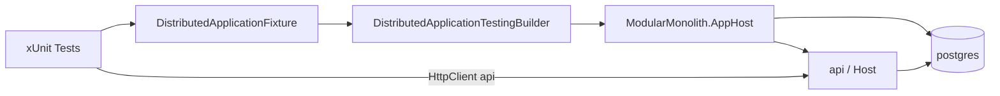

# Requirements

### Overview & Goals
Expand the `ModularMonolith.AppHost.Tests` project from a single smoke test into a full suite of **Aspire integration tests** that exercise every path of the distributed application defined in `src/ModularMonolith.AppHost/AppHost.cs`.

The goal is to validate that the orchestrated system (PostgreSQL + the `api` project) boots correctly, all resources become healthy, the database wiring works, and every HTTP surface exposed by the `api` resource behaves as expected.

### Scope
**In Scope**
- Integration tests driven by `DistributedApplicationTestingBuilder` for the AppHost.
- Verifying that all AppHost resources (`postgres`, the `resourcebooking` database, and `api`) start and reach a healthy state.
- Covering all HTTP paths reachable on the `api` resource:
  - Health endpoints: `/health` (ready) and `/alive` (live).
  - API documentation surface: `/openapi` and `/scalar`.
  - Root redirect `/` (Development environment).
  - The reservations API: `POST /api/reservations` (validation failure and business-rule failure paths).
- Shared test infrastructure (a reusable fixture/helper that builds and starts the distributed app once per test class to reduce startup cost).

**Out of Scope**
- Unit tests of handlers/validators (belong to module-level test projects, which do not currently exist).
- Database seeding or migrations changes to the production code.
- A successful reservation-creation happy path (no seed data exists, so a valid create currently returns a business failure — see Technical Design).
- Authentication token issuance flows (no auth-protected endpoints exist yet).

### Functional Requirements
1. The distributed application builds and starts successfully via the testing builder.
2. The `postgres` resource reaches the **Running/Healthy** state.
3. The `api` resource reaches the **Healthy** state and serves `/health` with `200 OK`.
4. `/alive` returns `200 OK` (liveness, independent of the database).
5. `/openapi` returns a successful response containing a valid OpenAPI document.
6. `/scalar` returns a successful response (API reference UI).
7. `POST /api/reservations` with an invalid payload (e.g. empty GUIDs or past start time) returns `400 Bad Request` with validation errors.
8. `POST /api/reservations` with a structurally valid payload referencing a non-existent user returns `400 Bad Request` with the "User not found." business error (validates the full request → handler → DbContext → PostgreSQL path).

### Non-Functional Requirements
- Tests must be deterministic and use bounded timeouts (mirror the existing `DefaultTimeout`).
- Tests must clean up the distributed app (`await using`).
- Suite should minimize repeated AppHost startup cost by sharing the started application across tests where practical.

# Technical Design

### Current Implementation
- `test/ModularMonolith.AppHost.Tests/IntegrationTest1.cs` contains one test, `Api_Resource_Starts_And_Is_Healthy`, that:
  - Creates the app host via `DistributedApplicationTestingBuilder.CreateAsync<Projects.ModularMonolith_AppHost>`.
  - Builds/starts it with `DefaultTimeout = 30s`.
  - Creates `app.CreateHttpClient("api")`, waits for the `api` resource healthy, and asserts `/health` returns `200 OK`.
- `test/ModularMonolith.AppHost.Tests/ModularMonolith.AppHost.Tests.csproj` already references `Aspire.Hosting.Testing` (13.4.6), `xunit`, `coverlet.collector`, and the AppHost project, with global usings for `System.Net`, `Aspire.Hosting.Testing`, `Aspire.Hosting.ApplicationModel`, `Microsoft.Extensions.DependencyInjection`, and `Xunit`.
- `src/ModularMonolith.AppHost/AppHost.cs` defines three logical resources: `postgres` (with pgAdmin + data volume), the `resourcebooking` database, and the `api` project (`ModularMonolith_Host`) that references and waits for postgres.
- `src/ModularMonolith.Host/Program.cs` maps: `/alive` + `/health` (via `MapDefaultEndpoints`), `/openapi` (`MapOpenApi`), `/scalar` (`MapScalarApiReference`), `/` redirect in Development, and `MapApiEndpoints` (`POST /api/reservations`).
- `src/ResourceBooking.ServiceDefaults/Extensions.cs`: `/alive` filtered to the `live` tag (DB-independent), `/health` filtered to `ready` (includes the NpgSql check).
- The only business endpoint is `POST /api/reservations` (`RouteConsts.BaseRoute`). Its validator requires non-empty `UserId`/`ResourceId`, future `StartTime`, and `EndTime > StartTime`. With no seed data, a valid request returns the `"User not found."` failure as `400 Bad Request`.

### Key Decisions
- **Shared application fixture:** Introduce an xUnit class fixture (`DistributedApplicationFixture` implementing `IAsyncLifetime`) that builds and starts the AppHost once and exposes the started `DistributedApplication`. Rationale: starting an Aspire app (with a real PostgreSQL container) is expensive; sharing it across read-only HTTP assertions keeps the suite fast. Tests that need isolation can still create their own builder.
- **Test against the real orchestrated stack:** Continue using `DistributedApplicationTestingBuilder` rather than `WebApplicationFactory`, since the task targets the AppHost project's paths (resource orchestration + wiring), not isolated module logic.
- **No happy-path reservation create:** Because no seeding exists, assert the documented failure paths (validation `400` and business `400 "User not found."`) instead of a `200` create. This still fully exercises the HTTP → handler → EF Core → PostgreSQL path. Rationale: avoids modifying production code to add seed data, which is out of scope.
- **Resource-state assertions:** Use `app.ResourceNotifications.WaitForResourceHealthyAsync` for `api` and `WaitForResourceAsync`/health for `postgres` to assert orchestration paths.

### Proposed Changes
1. **Add a shared fixture** `DistributedApplicationFixture.cs` that builds and starts the AppHost (`IAsyncLifetime`), exposes the `DistributedApplication`, and provides a helper to obtain a healthy `api` HttpClient.
2. **Reorganize/rename** the smoke test into focused test classes grouped by concern, all using the shared fixture via `IClassFixture<DistributedApplicationFixture>` (or a collection fixture if shared across classes).
3. **Add tests** for resource startup/health, health endpoints, documentation endpoints, root redirect, and the reservations endpoint failure paths.
4. Keep `DefaultTimeout` semantics and `await using` lifecycle handling consistent with the existing test.

### Data Models / Contracts
- Reservations request DTO (existing): `CreateReservationRequest(Guid UserId, Guid ResourceId, DateTime StartTime, DateTime EndTime)`.
- Validation-failure payload: `POST /api/reservations` with empty GUIDs / past `StartTime` → `400` with validation dictionary.
- Business-failure payload: valid future times + random GUIDs → `400` with `{ Error = "User not found." }`.

### File Structure
```
test/ModularMonolith.AppHost.Tests/
  Infrastructure/
    DistributedApplicationFixture.cs        (new)
  AppHostResourceTests.cs                   (new - startup/health of postgres & api)
  HealthEndpointTests.cs                    (new - /health, /alive)
  ApiDocumentationTests.cs                  (new - /openapi, /scalar, /)
  ReservationsEndpointTests.cs              (new - POST /api/reservations failure paths)
  IntegrationTest1.cs                       (removed/migrated into the above)
```

### Architecture Diagram


### Risks
- **Container startup time/flakiness:** PostgreSQL container start can be slow on CI; mitigate with the shared fixture and generous but bounded timeouts.
- **Root redirect depends on Development environment:** the `/` redirect only maps in Development; the test must assert the redirect only when the resource runs in Development (or assert the non-redirect behavior otherwise) — disable auto-redirect following on the HttpClient and assert the `3xx`/`Location`.
- **Docker availability:** these tests require Docker; document this and let them be skipped/failed clearly if Docker is unavailable (matches the existing test's requirement).

# Delivery Steps

### ✓ Step 1: Add shared distributed-application test fixture
A reusable fixture starts the AppHost once and exposes the running application and a healthy api HttpClient.

- Add `Infrastructure/DistributedApplicationFixture.cs` implementing `IAsyncLifetime`.
- In `InitializeAsync`, create the host via `DistributedApplicationTestingBuilder.CreateAsync<Projects.ModularMonolith_AppHost>`, then `BuildAsync`/`StartAsync` with a bounded `DefaultTimeout`.
- Expose the started `DistributedApplication` and a `CreateApiHttpClientAsync()` helper that calls `CreateHttpClient("api")` and `ResourceNotifications.WaitForResourceHealthyAsync("api", ...)`.
- Dispose the app in `DisposeAsync` (`await using` semantics).
- Define a shared `DefaultTimeout` constant consistent with the existing test.

### ✓ Step 2: Add resource startup and health-endpoint tests
Tests confirm all AppHost resources start healthy and the health/liveness endpoints respond.

- Add `AppHostResourceTests.cs` using `IClassFixture<DistributedApplicationFixture>`.
  - Assert the `postgres` resource reaches Running/Healthy via `ResourceNotifications`.
  - Assert the `api` resource reaches Healthy.
- Add `HealthEndpointTests.cs`.
  - `Health_Endpoint_Returns_Ok` — `GET /health` returns `200 OK` (ready, includes NpgSql check, validating DB wiring).
  - `Alive_Endpoint_Returns_Ok` — `GET /alive` returns `200 OK` (liveness).
- Migrate/remove the original `IntegrationTest1.cs` smoke test into these classes.

### ✓ Step 3: Add API documentation and root-redirect tests
Tests cover the OpenAPI/Scalar documentation surface and the root redirect path of the api resource.

- Add `ApiDocumentationTests.cs` using the shared fixture.
  - `OpenApi_Endpoint_Returns_Document` — `GET /openapi/v1.json` (or mapped path) returns success and a non-empty OpenAPI document.
  - `Scalar_Endpoint_Returns_Success` — `GET /scalar` returns a successful response.
  - `Root_Redirects_To_Scalar_In_Development` — configure the HttpClient to not auto-follow redirects and assert the `3xx` + `Location` to `/scalar` (guarded for the Development environment behavior).

### ✓ Step 4: Add reservations endpoint failure-path tests
Tests exercise the POST /api/reservations request pipeline through to PostgreSQL via its validation and business-failure paths.

- Add `ReservationsEndpointTests.cs` using the shared fixture.
  - `CreateReservation_WithInvalidPayload_ReturnsBadRequest` — post empty GUIDs / past `StartTime` and assert `400 Bad Request` with validation errors.
  - `CreateReservation_WithUnknownUser_ReturnsUserNotFound` — post valid future times with random GUIDs and assert `400 Bad Request` containing the `"User not found."` business error, confirming the full HTTP → handler → EF Core → PostgreSQL path.
- Use the `CreateReservationRequest` shape for payloads and serialize via `System.Net.Http.Json`.